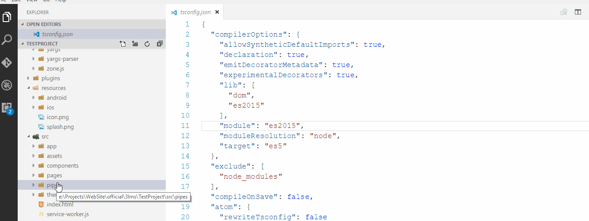

# ionic 2 Commands & Snippets for VS Code

**Ionic 2 snippets & Commands **

This extension for Visual Studio Code adds snippets for ionic 2 for TypeScript and HTML.



## Snippets Usage
Type part of a snippet, press `enter`, and the snippet unfolds.


### HTML Snippets
```Typescript
i2-list             //add a ionic list with header and item 
i2-list-grp         //add a ionic list with header, group and item
i2-list-reord-grp   //add a ionic group with reorder and iterator
i2-itm-grp          //use to add a group section with an item inside an ion list
i2-itm-slide        //Add a sliding item in the list use both side
i2-Infinite         //Use this Snippet at the bottom of the list also look at the method create one to access it
i2-itm-for          //Add a ion item to ion-list with for loop
i2-itm-input        //Add a ion item to ion-list with inputs
i2-dtFormat         //Add a date format to the date field 
i2-itm              //Add a ion item to ion-list
i2-carousel         //Add a slider any where
i2-radiogroup       //Add a Radio group with iterator
i2-search           //Add a searchbar
i2-range            //Add a Range Control
```

### Type Script Snippets
```Typescript
i2-infinite         //ionic 2 Infinite scroll items update snippet with async operation
i2-alert            //ionic 2 alert snippet Import and Use the alertController, don't forget to insert int the constructor
i2-event            //ionic 2 Event snippet Create and Consume
i2-event-raise      //ionic 2 Event snippet for Create
i2-event-handle     //ionic 2 Event snippet for Consume
i2-reorder          //ionic 2 Reorder an item in list
```

Alternatively, press `Ctrl`+`Space` (Windows, Linux) or `Cmd`+`Space` (OSX) to activate snippets from within the editor.

## Commands Usage
Open the Command pallate under the view menu or press `Ctrl`+`Shift`+`p`.  
Type `Ionic` and select a Command from the list showing  
press `enter` then follow the options

### New Ionic Commands Added
* `Ionic Serve`
* `Ionic Generate`
* `Ionic Build`
* `Ionic Emulate`
* `Ionic Run`
* `Ionic Serve Options`
* `Ionic Package`
* `Ionic Resources`
* `Ionic State`
* `Kill running Ionic Process`

So far Commands are testd in Windows 10 env only,  
some commands will not work, if it need some input in between the Process.   
soon open a git hub repo for update the source.

##### Change Log
2.2.0
* Ionic Generate command added in explorer context menu. 
    * Right click on the pages folder and select the ionic generate 
    * Enter the page name to create a page
    * The above steps fit to the rest of the ionic generate items
    * if you select the command any where else, it will open the usual ionic generate command
* New Commands added 
    * Ionic serve with options
    * Ionic Package- Note: if login is expected, command will not work properly
    * Ioinc Resources
    * Ioinc State
* In the new version of ionic cli {page}.scss is Automatically added based on import statement, so i removed the implementaion of including {page}.scss in app.core.scss file
    
2.1.3
* minor bug fix for scss import statement

2.1.0   
* since finding error in output console is too hard, so shown the error in messagebox.  
* ionic generate page command: Automatically add the scss file reference in app.core.scss
* Add some basic validation 
   
2.0.0   
* Added new commands for ionic2 cli,
* It consumes the following commands   
*** serve, build, generate, run, kill Process
